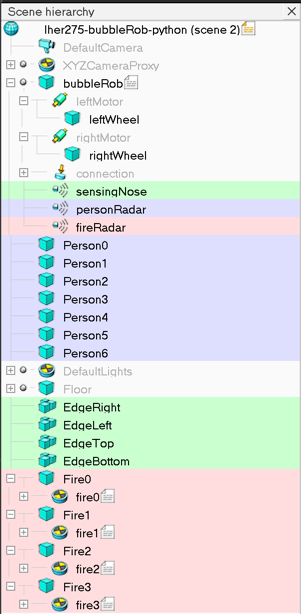
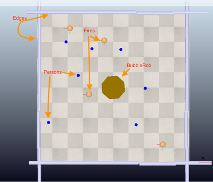
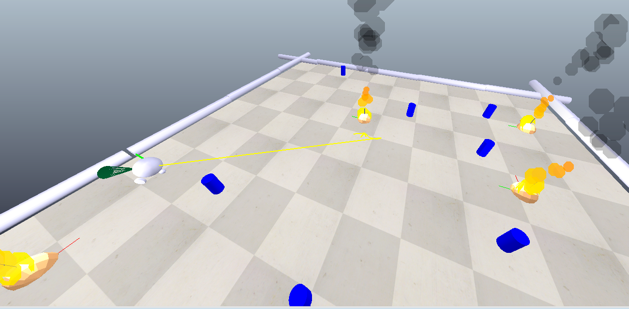
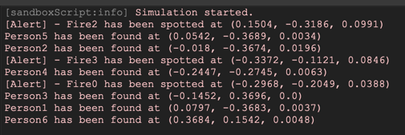

# BubbleRob Disaster Recovery Simulation

This repository contains the CoppeliaSim program designed for simulating disaster recovery operations. BubbleRob is an autonomous robot that navigates a virtual urban environment, identifying survivors and detecting fire hazards. The robot uses a combination of proximity sensors and internal mapping to traverse the environment and report critical information to support rescue operations.

## Project Overview

BubbleRob is deployed in a simulated disaster zone, typically following an earthquake or similar catastrophic event. The environment is populated with obstacles, including simulated fires (orange objects) and stranded individuals (blue objects), representing survivors in need of rescue.

### Key Features
- **Autonomous Navigation:** BubbleRob navigates the environment independently, avoiding obstacles and hazards based on sensor input.
- **Person Proximity Sensor (personRadar):** Detects survivors within the environment and logs their locations for rescue operations.
- **Fire Proximity Sensor (fireRadar):** Identifies fire hazards and helps BubbleRob avoid dangerous areas, reporting fire locations to the console.
- **Internal Mapping:** BubbleRob maintains an internal representation of the environment to guide its navigation and avoid revisiting previously explored areas.

### How It Works
BubbleRob explores the disaster environment, using its sensors to detect survivors and fire hazards. Upon identifying a fire, it records and logs the exact location to alert rescue teams. When it finds a survivor, it logs the coordinates and continues its search. This information aids first responders in planning their operations and reduces risk.

### Improving the Prototype
The current version of BubbleRob is effective in its role, but there are several areas for improvement:
- **Reinforced Learning:** Implementing reinforced learning could help BubbleRob learn from its experiences and refine its search patterns.
- **Advanced Search Algorithms:** Integrating algorithms like A* or RRT could enhance BubbleRob's pathfinding capabilities, allowing for more efficient exploration.
- **Additional Sensors:** Adding more sensors or expanding their range could increase BubbleRob's situational awareness and improve obstacle avoidance.

### Getting Started
To run this CoppeliaSim program, follow these steps:
1. Install CoppeliaSim on your system.
2. Clone this repository to your local machine.
3. Open the provided CoppeliaSim scene file.
4. Run the simulation and observe BubbleRob's behavior.

### Screenshots

_Scene hierarchy_

_Grid Layout_

_BubbleRob in motion_

_Location Output_

For detailed instructions on installing and running CoppeliaSim, please refer to the official CoppeliaSim documentation.